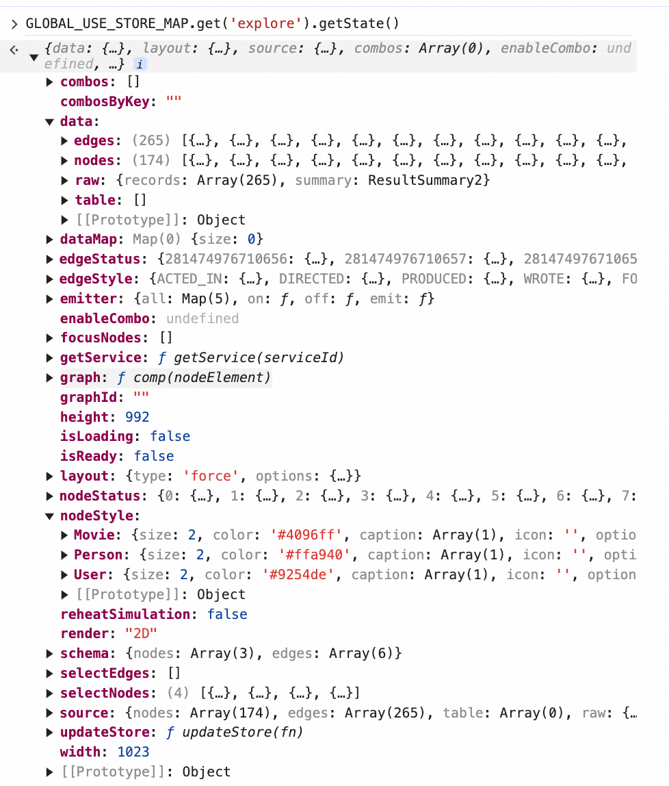

`@graphscope/studio-graph` 提供了非常简单的数据管理能力，通过 `<GraphProvider />` 提供全局数据，在组件内部通过 `useContext` 获得全局数据，从而实现数据共享。有且仅有这一个API。

注意⚠️：全局数据管理最令人诟病的就是性能问题，不用担心，我们在内部封装了[`@graphscope/use-zustand`](https://github.com/GraphScope/portal/blob/main/packages/use-zustand/src/index.tsx#L84)，在技术层面做到了完全的按需更新渲染

## GraphProvider

`<GraphProvider />` 是一个全局数据的提供者，源码在[这里](https://github.com/GraphScope/portal/blob/main/packages/studio-graph/src/hooks/useContext.tsx#L101)

| props    | desc                                    | default          |
| -------- | --------------------------------------- | ---------------- |
| id       | 多实例管理需要的唯一表示                | 默认是uuid生成的 |
| services | 注册的数据服务，可以通过getServices获得 | {}               |

## useContext

通过 `<GraphProvider />` 包裹的组件，在内部可以通过 `useContext` 获得全局数据

```jsx | pure
import { useContext } from '@graphscope/studio-graph';

export default () => {
  const { store, updateStore, id } = useContext();
  console.log(store, updateStore, id);
  return null;
};
```

其中 `store`的值是一个对象，可以参考下表

| key in store | 描述                                            |
| ------------ | ----------------------------------------------- |
| data         | 画布中渲染显示的数据                            |
| source       | 一般是做 `data`的备份，在一些数据恢复场景下需要 |
| schema       | 图模型                                          |
| layout       | 布局实例                                        |
| combos       | 聚类分组数据                                    |
| nodeStyle    | 节点样式配置                                    |
| edgeStyle    | 边的样式配置                                    |
| nodeStatus   | 节点的状态配置                                  |
| edgeStatus   | 边的状态配置                                    |
| width        | 画布的宽度                                      |
| height       | 画布的高度                                      |
| graph        | Graph 实例                                      |
| emitter      | 和 Graph 绑定的事件管理器                       |
| isLoading    | 画布异步加载状态（常用于数据请求时候设置）      |
| focusNodes   | 画布需要聚焦的节点ID集合                        |
| getService   | 数据请求服务，通过 `getServices`获得            |

注意 ⚠️：因为 `useContext` 是由 `@graphscope/use-zustand` 封装的，因此，我们可以直接在 windows 对象上获取整个 store 的值，常用于开发测试，观察状态变化。

```js | pure
// 假设你的实例 id 设置的为 explore
GLOBAL_USE_STORE_MAP.get('explore').getState();
```


