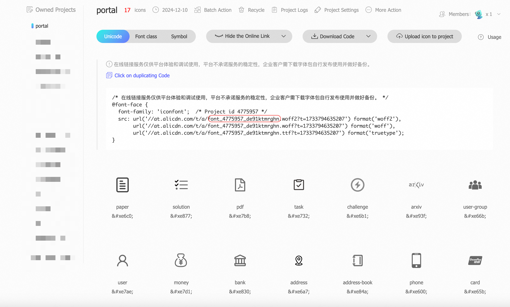

## 01. 设置颜色/大小/文本

在 `@graphscope/studio-graph`的设计中，样式数据和图数据是分离的。节点的样式数据在 `store.nodeStyle` 中，边的样式数据在 `store.edgeStyle` 中。

考虑到Schema的批量映射和高级映射，

```jsx
import React, { useEffect } from 'react';
import { Canvas, GraphProvider, Prepare, useContext } from '@graphscope/studio-graph';
import { data, schema } from './const';
const CustomGraphFetch = () => {
  const { store, updateStore } = useContext();
  useEffect(() => {
    updateStore(draft => {
      draft.data = data;
      draft.schema = schema;
      draft.source = data;
      draft.nodeStyle = {
        'id-1': {
          color: 'red',
          size: 10,
          caption: ['name', 'age'],
        },
      };
    });
  }, []);
  return null;
};
export default () => {
  return (
    <div style={{ height: '100px' }}>
      <GraphProvider id="graph-3">
        <CustomGraphFetch />
        <Canvas />
      </GraphProvider>
    </div>
  );
};
```

目前在 `store.nodeStyle` 和 `store.edgeStyle` 中，只有4个参数可以配置，分别是：

| key     | desc                   | default |
| ------- | ---------------------- | ------- |
| color   | 节点/边的颜色          | #ddd    |
| size    | 节点大小 或者 边的粗细 | 2       |
| caption | 节点/边的标签          | []      |
| icon    | 节点图标               | ''      |

需要注意的是 `caption` 是数组，可以配置多个展示标签，考虑文本的映射可以根据Schema批量设置和高级映射配置，因此`caption`是一组图数据中`properties`的数值映射字段，而非静态数值

## 02. 设置图标

`@graphscope/studio-graph` 提供了 `registerIcons`方法来注册节点图标，标的设置依然在 `store.nodeStyle` 中

```jsx | pure
import { registerIcons } from '@graphscope/studio-graph';
registerIcons();
```

```jsx
import React, { useEffect } from 'react';
import { Canvas, GraphProvider, Prepare, useContext, registerIcons } from '@graphscope/studio-graph';
import { data, schema } from './const';
registerIcons();
const CustomGraphFetch = () => {
  const { store, updateStore } = useContext();
  useEffect(() => {
    updateStore(draft => {
      draft.data = data;
      draft.schema = schema;
      draft.source = data;
      draft.nodeStyle = {
        'id-1': {
          color: 'red',
          size: 10,
          caption: ['name', 'age'],
          icon: 'logo',
        },
      };
    });
  }, []);
  return null;
};
export default () => {
  return (
    <div style={{ height: '100px' }}>
      <GraphProvider id="5">
        <CustomGraphFetch />
        <Canvas />
      </GraphProvider>
    </div>
  );
};
```

## 官方内置图标库一览

```jsx
import React, { useState, useEffect } from 'react';
import { Space, Flex, Typography } from 'antd';
import { registerIcons } from '@graphscope/studio-graph';

export default () => {
  const [icons, setIcons] = useState({});
  useEffect(() => {
    registerIcons().then(res => {
      setIcons(res);
    });
  }, []);

  return (
    <Flex wrap gap={44}>
      {Object.keys(icons).map(key => {
        return (
          <Flex key={key} gap={8} vertical align="center">
            <span style={{ fontFamily: 'iconfont', fontSize: '30px' }}>{icons[key]}</span>
            <Typography.Text>{key}</Typography.Text>
          </Flex>
        );
      })}
    </Flex>
  );
};
```

## 自定义图标

在实际业务使用场景中，我们需要自定义图标，我们需要先在 [iconfont](https://www.iconfont.cn/) 平台上创建一个自己的图标项目，然后选择`unicode`生成链接。如下图所示，红框选出来的即使 iconfont 的`id`


我们只需要将此ID赋值给`registerIcons`即可

```jsx | pure
import { registerIcons } from '@graphscope/studio-graph';
const iconfontId = 'xxxxxxxxxxx';
registerIcons(iconfontId);
```

## 和样式相关的组件

| 组件名         | 功能描述                                     |
| -------------- | -------------------------------------------- |
| StyleSetting   | 负责点边颜色，大小，文本的基础设置和高级映射 |
| CurvatureLinks | 展开或者合并多边，默认是合并多边             |

```jsx | pure
import { StyleSetting, CurvatureLinks } from '@graphscope/studio-graph';
```
